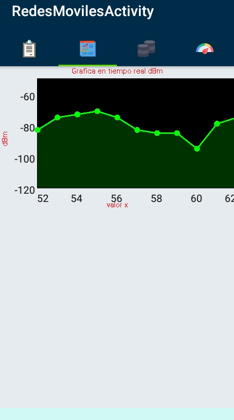

# SmartMobileNetworks

Aplicacion android la cual cuenta con las siguientes caracteristicas

*Medir nivel de asu y dbm de redes 2G , 3G Y 4G     
*Mostrar imformacion general sobre el estado de la red movil del dispositivo  
*Grafica en tiempo real que muestra dbm y asu  
*Base de datos de sqlite en la cual se guardan los registros de las pruebas realizadas  
*Historial de Pruebas Muestra en una tabla todos los resultados de las pruebas realizadas  
y se puede filtrar por fecha,dbm,asu,red y red telefonica  
*Se puede exportar todos los registros a un archivo de ecxel  
*Notificacion cuando la red cambia por ejemplo de 3G a 4G  
*Cambio en tiempo real de la imformacion en el fragmnet Imformacion dispositivo  
*En el fragment pruebas se realizan pruebas que se almacena en la base de datos  

*En este proyectos se usaron las siguientes librerias  
  *SpeedView
    https://github.com/anastr/SpeedView  
  *GraphView
    https://github.com/jjoe64/GraphView  
  *SQLite2XL
    https://github.com/androidmads/SQLite2XL  

<table>
  <tr>
    <td> <h4>Fragment Pruebas</h4></td><td><h4>Fragment Pruebas</h4></td>
  </tr>
  <tr>
    <td><h4>Fragment Historial Pruebas</h4></td><td><h4>Fragment Historial pruebas</h4></td>
  </tr>
  <tr>
    <td><h4>Fragment Historial Pruebas</h4></td><td><h4>Fragment Grafica</h4></td>
  </tr>
  <tr>
    <td><h4>Fragment Imformacion dispositivo</h4>
  </tr>
</table>
